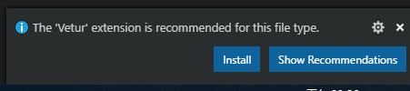

# Vue Template

vue-cli + vue-router

<br />

## Install

```sh
#upgrade npm if need
$ npm install -g npm@latest

$ npm install -g vue

$ npm install -g @vue/cli
```

<br />

## Start

```sh
$ vue create PROJECT

$ cd PROJECT

$ npm run serve
```


<br />



## Router

install

```sh
$ npm install vue-router --save-dev
```

main.js

```javascript
import Vue from 'vue'
import VueRouter from 'vue-router'

Vue.use(VueRouter);

// pages
import Hello from './pages/Hello.vue';

const router = new VueRouter({
  mode: 'history',
  routes: [
    {
      path: '/hello',
      name: 'hello',
      component: Hello,
    }
  ]
});

new Vue({
  router,
  render: h => h(App),
}).$mount('#app')
```

<br />

## Build

```sh
$ npm run build
```

<br />

## Style Scope
```html
<style scoped>
  p {
    ...
  }
</style>
```

<br />

## Meta

```javascript
router.afterEach((to, from) => {
  Vue.nextTick( () => {
    document.title = to.meta.title ? to.meta.title : 'default title';
  });
});
```

## Component

<br />

## Slot

<br />

## Prerender

SEO

prerender

nuxt.js
