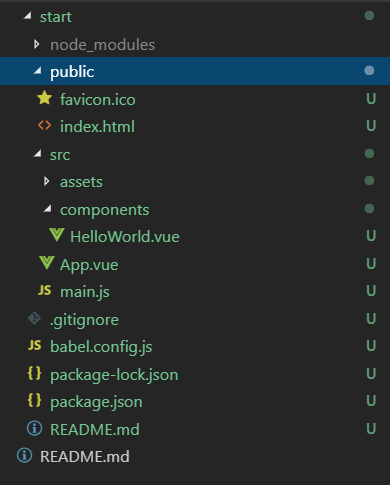
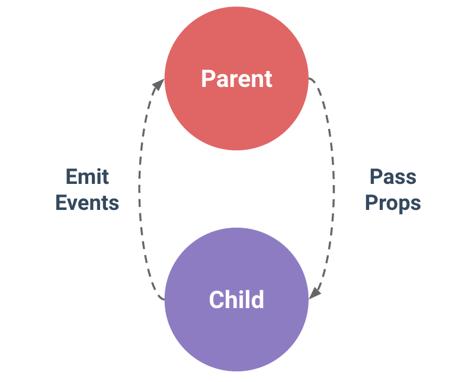

# Vue Template

tools version:

**vue-cli** `3.5.0` + **vue-router** `3.0.2` + **vue** `2.6.6`

<br />

## Vue CLI 3

快速產生開發環境：自動化配置、檔案結構

* vue-cli 3 是基於 webpack 4 構建

* 零配置/最少配置

* 以插件進行擴展

<br />

## Install

```sh
#upgrade npm if need
$ npm install -g npm@latest

$ npm install -g vue

$ npm install -g @vue/cli

# npm install -g yarn
```

<br />

## Start

```sh
$ vue create PROJECT

$ cd PROJECT

$ npm run serve
# 或
$ yarn serve
```



<br />

Vetur: Vue tooling for VS Code


<br />

### 

vue-cli service

```sh
$ npm install -g @vue/cli-service-global

# Valid entry file should be one of: main.js, index.js, App.vue or app.vue.
$ cd src
$ vue serve
```

<br />

## Router

install

```sh
$ npm install vue-router --save-dev

# 或

# 以插件方式引入預設配置
$ vue add router
```

main.js

```javascript
import Vue from 'vue'
import VueRouter from 'vue-router'

// 使用插件
Vue.use(VueRouter);

// pages
import Hello from './pages/Hello.vue';

const router = new VueRouter({
  mode: 'history',
  routes: [
    {
      path: '/hello',
      name: 'hello',
      component: Hello,
    }
  ]
});

new Vue({
  router,
  render: h => h(App),
}).$mount('#app')
```

App.vue
```html
<template>
  <div>
    <router-link :to="{path: '/hello'}" class="nav">Hello</router-link>
    <router-view></router-view>
  </div>
</template>
```

<br />

## Build

```sh
$ npm run build
```

<br />

## Style Scope

[CSS 作用域](https://vue-loader-v14.vuejs.org/zh-cn/features/scoped-css.html)

將 css 限定在當前的 template 內，避免 CSS 交互影響


```html
<style scoped>
  div {
    ...
  }
</style>
```


<br />

## Meta

SPA 如何置換網站標題及 meta tag 的內容?

```javascript
router.afterEach((to, from) => {
  Vue.nextTick( () => {
    document.title = to.meta.title ? to.meta.title : 'default title';
  });
});
```

<br />

## Component | 組件

Assemble.vue

*單文件組件格式 Single-File Component*

一隻檔案就是一個 component


```html
<template>
  <div>
    <vheader></vheader>
  </div>
</template>

<script>
export default {
  components: {
    vheader
  }
}
</script>

<style>
  div {
    ...
  }
</style>
```

<br />

## Slot | 插槽

將 component 挖洞，由外部注入內容

content.vue
```html
<template>
  <div>
    <slot name="right" class="right"></slot>
  </div>
</template>
```

Assemble.vue
```html
<template>
  <div>
    <vcontent>
      <div slot="right" class="right">RIGHT</div>
    </vcontent>
  </div>
</template>
```

### Props in, events out

;

資料透過 props 傳入，而更新透過 events 觸發。


<br />

## Prerender

如何解決 Server Side Rendering 的 SEO 問題

[prerender-spa-plugin](https://github.com/chrisvfritz/prerender-spa-plugin)

[nuxt.js](https://github.com/nuxt/nuxt.js)

<br />

## Reference

[如何配置 vue-cli 3.0 的 vue.config.js](https://segmentfault.com/a/1190000016101954)

[實作小範例入門 Vue & Vuex 2.0](https://ithelp.ithome.com.tw/users/20103326/ironman/1114)


vue router 切換頁面畫面殘留問題

[vue-router路由切换 组件重用挖下的坑](https://blog.csdn.net/Clark_Fitz817/article/details/79134944)


[Dynamic Component Templates with Vue.js](https://medium.com/scrumpy/dynamic-component-templates-with-vue-js-d9236ab183bb)
