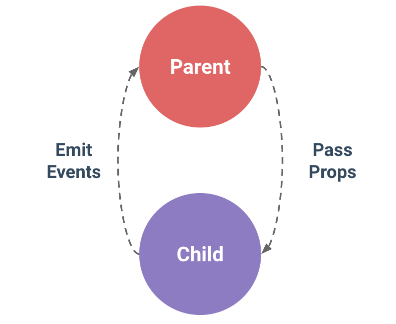

## Component | 組件

Assemble.vue

*單文件組件格式 Single-File Component*

一隻檔案就是一個 component


```html
<template>
  <div>
    <vheader></vheader>
  </div>
</template>

<script>
export default {
  components: {
    vheader
  }
}
</script>

<style>
  div {
    ...
  }
</style>
```

<br />

## Slot | 插槽

將 component 挖洞，由外部注入內容

content.vue
```html
<template>
  <div>
    <slot name="right" class="right"></slot>
  </div>
</template>
```

Assemble.vue
```html
<template>
  <div>
    <vcontent>
      <div slot="right" class="right">RIGHT</div>
    </vcontent>
  </div>
</template>
```

## Props in, Events out

;

資料透過 props 傳入，而更新透過 events 觸發。

HTML
```html
<div id="app">
  <h3>Total: {{sum}}</h3>
  <button-counter :initial-counter="10" @add-sum="sum++" @init-sum="count_sum"></button-counter>
  <button-counter :initial-counter="20" @add-sum="sum++" @init-sum="count_sum"></button-counter>
  <button-reset></button-reset>
</div>
```

JS
```js
var event_handler = new Vue();

Vue.component("button-reset", {
  template: '<button @click="reset">reset</button>',
  methods: {
    reset: function() {
      event_handler.$emit("reset");
    }
  }
});

Vue.component("button-counter", {
  props: ["initialCounter"],
  data() {
    return {
      count: this.initialCounter || 0
    };
  },
  template:
    "<button @click=\"count++; $emit('add-sum')\">You clicked me {{ count }} times.</button>",
  methods: {
    reset_count: function() {
      this.count = 0;
    }
  },
  created: function() {
    event_handler.$on("reset", this.reset_count);
  },
  mounted: function() {
    this.$emit("init-sum", this.count);
  }
});

new Vue({
  el: "#app",
  data: {
    sum: 0
  },
  methods: {
    count_sum: function(value) {
      this.sum += value;
    },
    reset_sum: function() {
      this.sum = 0;
    }
  },
  created: function() {
    event_handler.$on("reset", this.reset_sum);
  }
});
```
<br />

## Reference

[Dynamic Component Templates with Vue.js](https://medium.com/scrumpy/dynamic-component-templates-with-vue-js-d9236ab183bb)

[VueJS 元件 (Component) 之間資料溝通傳遞的方式|Kuro's Blog](https://kuro.tw/posts/2018/08/22/VueJS-%E5%85%83%E4%BB%B6-Component-%E4%B9%8B%E9%96%93%E8%B3%87%E6%96%99%E5%82%B3%E9%81%9E%E7%9A%84%E6%96%B9%E5%BC%8F/)
